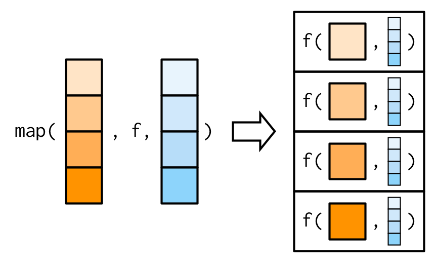

```{r setup, include=FALSE}
knitr::opts_chunk$set(echo = TRUE)
```

## Introduction

In this learning lab, we estimate again a logistic regression but on 10-fold [cross validation](https://machinelearningmastery.com/k-fold-cross-validation/) samples. Cross validation will allow us to select the best model; by best I mean a model that has a good hyper-parameter configuration, enabling the model to generalize well to unseen data.

We will also learn how to change learning algorithms to compare different machine learning models.

### Load the package

```{r}
library(tidymodels)
library(tidyverse)
library(glmnet)
library(here)
library(rpart)
```

### Load the dataset

```{r}
dat_csv_combine <- read_csv(here("data", "dat_csv_combine_final.csv"))

dat_csv_combine <- dat_csv_combine %>% 
  mutate(isSTEM = as.factor(isSTEM))
```

### Rescale variable

Note - here we show how to write this function (that we also used in the last learning lab) using the {tidyverse} function `mutate()`:

```{r}
dat_csv_combine <- dat_csv_combine %>% 
  mutate(NumActions = rescale(NumActions, 
                                      to = c(0, 1), 
                                      from = range(NumActions, 
                                                   na.rm = TRUE, 
                                                   finite = TRUE)))
```

### Data splitting & resampling

This step, again, is similar to the step we took in the last learning lab:

```{r}
set.seed(123)

splits <- initial_split(dat_csv_combine, strata = isSTEM)

data_other <- training(splits) 

data_test  <- testing(splits)
```

## Cross validation

We will use `data_other` for cross validation. **V-fold cross-validation** randomly splits the data into V (here, 10) groups of roughly equal size (called "folds"). This is also often referred to as **K-fold cross-validation**.

The model that gets built on each fold is different. But the method for evaluation is the same!

We use cross-validation when we don't have enough data to have completely independent train and test sets and we compute the estimate by averaging performance over all the folds.

Also, evaluation over just part of the data is likely to be misleading.

```{r}
set.seed(234)

data_other <- data_other %>% 
  mutate(isSTEM = as.factor(isSTEM))

cv_train <- vfold_cv(data_other, v = 10, strata = "isSTEM")
```

Set up the logistic regression model:

```{r}
logit_mod <- 
  decision_tree() %>%
    set_engine("rpart") %>%
    set_mode("classification")
```

Now, we can create a function `cv_fit` to fit the model with training set from data_other. We first need to define the function:

1.  the list of argument names are contained within parentheses;
2.  the body of the function--the statements that are executed when it runs; and,
3.  when we call the function, the values we pass to it are assigned to those variables so that we can use them inside the function. Inside the function, we use a return statement to send a result back to whoever asked for it.

We have two arguments in the function, `splits` is for getting the data set and `mod` specifies the type of model.

`analysis()`is used to get the data set for training.

```{r}
cv_fit <- function(splits, mod) {
  
  res_mod <-
    fit(mod, isSTEM ~ ., data = analysis(splits))
  
  return(res_mod)
}
```

Next, we can create another function `cv_pred()` to get predictions from holdouts, which is the testing data from data_other.

We have two arguments in the function, splits is for getting data set and mod specifies the type of model.

`assessment()`is used to get the data set for testing.

```{r}
cv_pred <- function(splits, mod){
  
  holdout <- assessment(splits)
  pred_assess <- bind_cols(truth = holdout$isSTEM, predict(mod, new_data = holdout))
  
  return(pred_assess)
}
```

Now, let's train the model and get predictions using the two functions (i.e., cv_fit and cv_pred).

`map()` takes a vector (here, 10 folds) and a function (here, logistic regression), calls the function once for each element of the vector, and returns the results in a list. As shown in the following image:

{width="300"}

`map2()` is vectorised over two arguments. As shown in the following image:

{width="300"}

```{r}
res_cv_train <- 
  cv_train %>% #cv_train includes our 10 folds
  mutate(res_mod = map(splits, .f = cv_fit, logit_mod), # fit model, splits are in cv_train
         res_pred = map2(splits, res_mod, .f = cv_pred)) # predictions, res_mod is the model, and this model is used for prediction
```

Look closely at `res_cv_train`, we can see that each fold has predictions in `res_pred`. `res_pred` has two columns, one column is the true value (i.e., truth) and the other column is the predicted value (`.pred_class`).

Next, let's take a look at the model performance with cross validation. Let's start with percent accuracy.

`unnest()` flattens nested columns into regular columns.

```{r}
accuracy_table <- res_cv_train %>% 
  mutate(metrics = map(res_pred, accuracy, truth = truth, estimate = .pred_class)) %>%
  unnest(metrics)
```

The percent accuracy of the model is the mean of 10 folds.

```{r}
mean(accuracy_table$.estimate)
```

#### [Your Turn]{style="color: green;"} ⤵ {style="font-style: normal; font-variant-caps: normal; letter-spacing: normal; orphans: auto; text-align: start; text-indent: 0px; text-transform: none; white-space: normal; widows: auto; word-spacing: 0px; -webkit-tap-highlight-color: rgba(26, 26, 26, 0.3); -webkit-text-size-adjust: auto; -webkit-text-stroke-width: 0px; text-decoration: none; caret-color: rgb(0, 0, 0); color: rgb(0, 0, 0);"}

Now, let's take a look at the kappa.

```{r}
#complete the code to get kappa (kap)
kappa_table <- res_cv_train %>% 
  mutate(metrics = map(res_pred, kap, truth = truth, estimate = .pred_class)) %>%
  unnest(metrics)
```

The kappa of the model is the mean of 10 folds.

```{r}
#write your code here
mean(kappa_table$.estimate)

test <- kappa_table$res_mod[1]

type(test)

rpart.plot(kappa_table$res_mod[1]$fit)
```

#### [Your Turn]{style="color: green;"} ⤵ {style="font-style: normal; font-variant-caps: normal; letter-spacing: normal; orphans: auto; text-align: start; text-indent: 0px; text-transform: none; white-space: normal; widows: auto; word-spacing: 0px; -webkit-tap-highlight-color: rgba(26, 26, 26, 0.3); -webkit-text-size-adjust: auto; -webkit-text-stroke-width: 0px; text-decoration: none; caret-color: rgb(0, 0, 0); color: rgb(0, 0, 0);"}

We used logistic regression as the learning algorithm. If we want to change the learning algorithm to other algorithms, such as decision tree. To build a decision tree, we will use the following code:

```{r}
decision_tree() %>%
  set_engine("rpart") %>%
  set_mode("classification")
```

Where would you replace to change the learning algorithm? Hint, you may see the power of using functions now!

## Reach

For this learning lab, your reach is to build a logistic regression model with your own data set, using cross validation.
